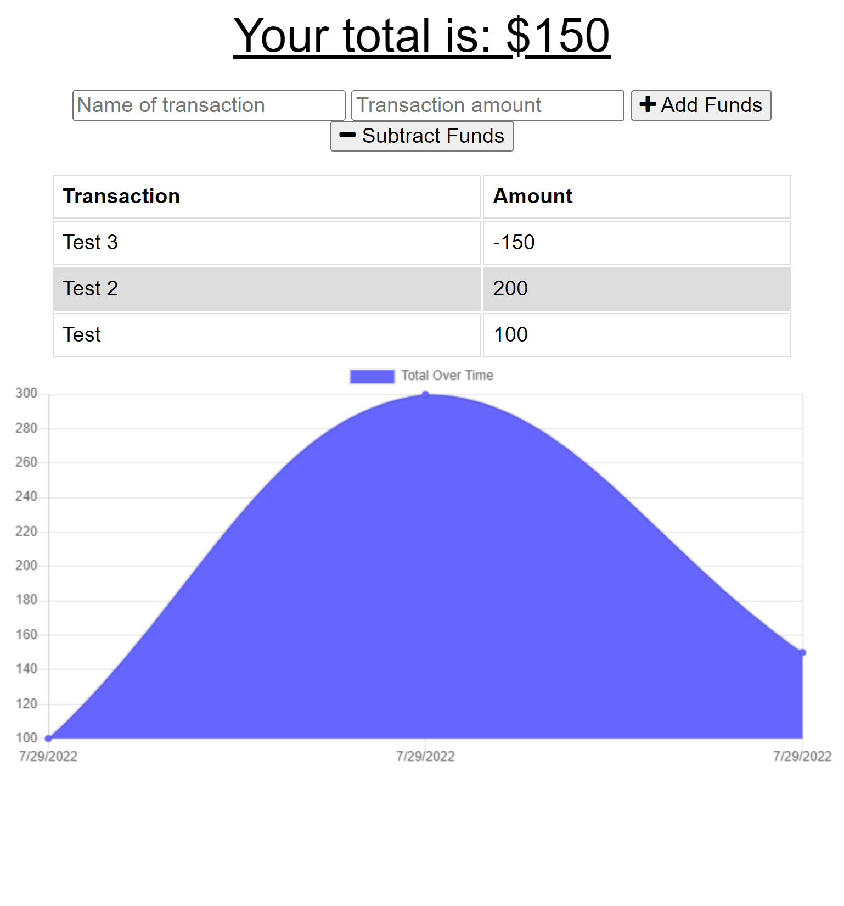

# Budget Tracker

## Description

A web application that allows users to keep track of their money as well as their withdrawals and deposits. The application is designed to have offline funtionality and access with users will be able to add expenses and deposits to their budget with/without internet connections and transcations made offline will be updated when the connection is back online.

## Table Of Content

- [Description](#description)
- [Installation](#installation)
- [Usage](#usage)
- [Screenshot](#screenshot)
- [Page Link](#page-link)
- [Questions](#questions)

## Installation

- Clone repository from https://github.com/ptran77/budget-tracker
- run 'npm i' to install packages
- run 'npm start' to start the server

## Usage

Users can title the transaction, set a certain amount of money, and press either 'Add Funds' to increase the total or 'Substract Funds' to decrease the total. Users are able to add or subtract funds online and offline.

## Screenshot

## Page Link

Link: https://budget-tracker-26833.herokuapp.com/

## Questions

Github: [ptran77](https://github.com/ptran77)

[Portfolio](https://ptran77.github.io/professional-portfolio/)

For any questions, contact me at pettran866@gmail.com
